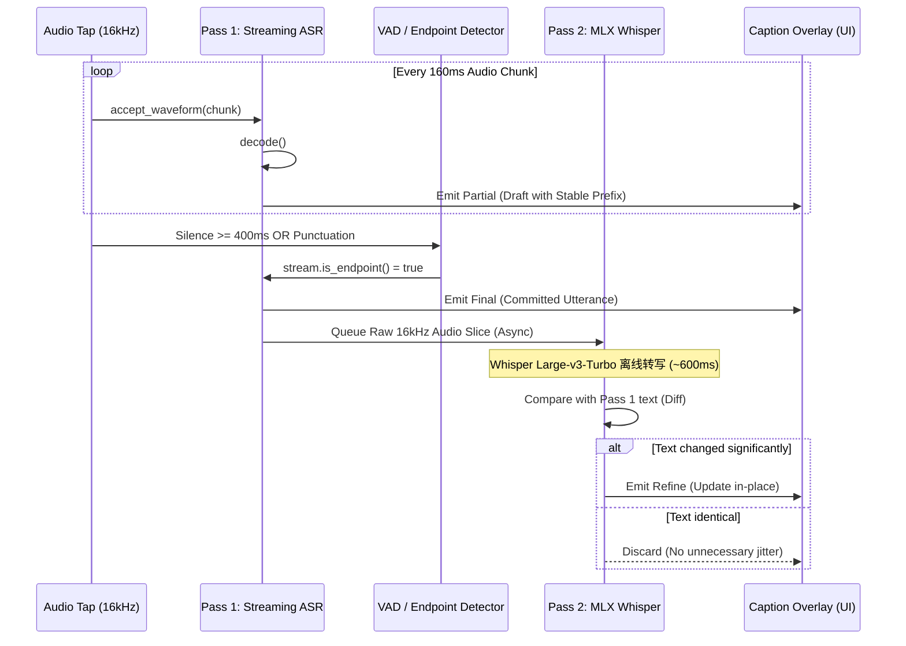

# 实时字幕与同传系统（Live Subtitle & Interpretation）架构研究与深度优化方案

> **文档版本**: 1.0.0  
> **日期**: 2026-08-24  
> **面向系统**: macOS (Apple Silicon & Intel) / Cross-Platform Desktop (Tauri 2.x + Rust + React 19)  
> **对标产品**: 字节跳动 豆包 (Doubao Mac 2.25.x)、Sigmise (Meeting Copilot 0.2.4)、WhisperLiveKit (SimulWhisper)、闪电说 (Shandianshuo)

---

## 目录

1. [行业顶级架构逆向与深度技术对标](#1-行业顶级架构逆向与深度技术对标)
   - 1.1 豆包 (Doubao.app) 实时语音同传架构深度剖析
   - 1.2 Sigmise (Meeting Copilot) 桌面端与云端双通道架构
   - 1.3 WhisperLiveKit / SimulStreaming 实时流式策略与算法
   - 1.4 闪电说 (Shandianshuo) 本地双通道转写与 AI 修正
   - 1.5 四款产品架构与工程参数横向对比表
2. [Lumen 实时字幕全链路现状与瓶颈分析](#2-lumen-实时字幕全链路现状与瓶颈分析)
3. [四层全链路深度优化方案与工程落地设计](#3-四层全链路深度优化方案与工程落地设计)
   - 模块一：音频采集与预处理层（Audio Capture & DSP）
   - 模块二：流式 ASR 与双通道转写调度层（Streaming Two-Pass ASR）
   - 模块三：流式同传与带上下文翻译编排层（Streaming Translation Engine）
   - 模块四：字幕排版、渲染动效与交互生命周期（On-Screen Subtitle UX）
4. [工程实施路径与状态机契约规范](#4-工程实施路径与状态机契约规范)

---

# 1. 行业顶级架构逆向与深度技术对标

实时字幕与同传系统是一个**高吞吐、低延迟、高并发、强状态**的复杂实时管道。我们将逆向分析获取的一手工程实现拆解如下：

```
┌────────────────────────────────────────────────────────────────────────────────────────┐
│                          现代实时字幕与同传系统典型拓扑架构                              │
├────────────────────────────────────────────────────────────────────────────────────────┤
│                                                                                        │
│  [音频源 (Audio Source)]                                                                │
│    │── CoreAudio Process Tap (macOS 14.2+ SPI) / ScreenCaptureKit                      │
│    │── 麦克风输入 (AVAudioEngine / CoreAudio Input)                                      │
│    ▼                                                                                   │
│  [音频 DSP & 缓冲层 (Audio DSP & RingBuffer)]                                          │
│    │── SPSC Lock-Free RingBuffer                                                       │
│    │── 重采样 (48kHz Stereo → 16kHz Mono Float32)                                      │
│    │── 能量门控 (RMS Gate) + Silero VAD (静音切分与休眠)                                │
│    ▼                                                                                   │
│  [流式 ASR 双通道引擎 (Two-Pass ASR Engine)]                                            │
│    │                                                                                   │
│    ├─▶ [Pass 1: 即时流 (Instant Stream, <150ms)]                                       │
│    │     • Streaming Paraformer / SenseVoice / Causal ASR                              │
│    │     • 词级稳定前缀计算 (LCP Prefix Lock)                                          │
│    │     ▼                                                                             │
│    │   [Draft 实时草稿] ──▶ 280ms 防抖 ──▶ 快速 MT/流式 LLM ──▶ [Draft 译文上屏]       │
│    │                                                                                   │
│    └─▶ [Pass 2: 终稿精修 (High-Accuracy Refine, ~1s)]                                  │
│          • VAD 端点断句 (Endpointing, 400ms 停顿)                                      │
│          • MLX Whisper-large-v3-turbo / Qwen3-ASR 异步整句重转写                        │
│          ▼                                                                             │
│        [Committed 最终定稿] ──▶ 携带前文 2 句上下文 ──▶ 主力 LLM ──▶ [定稿双语上屏]     │
│          │                                                                             │
│          └─▶ 文本差异度检测 (Levenshtein Diff) ──▶ [原地平滑修正 (In-place Refine)]    │
│                                                                                        │
└────────────────────────────────────────────────────────────────────────────────────────┘
```

---

## 1.1 豆包 (Doubao.app) 实时语音同传架构深度剖析

根据 `/Users/chris/source/research/doubao/Doubao-XRay-分析报告.md` 的静态逆向与符号分析，豆包 Mac 客户端（Chromium 147 + 自研 CUA + RTC 架构）在实时语音与同传方面的核心设计如下：

### 1.1.1 原生音频与网络子系统
- **音频采集栈**：`Contents/Frameworks/.../Libraries/libvoixcap.dylib`（898 KB）+ `VolcEngineRTCAudio.framework`（火山引擎 RTC 核心 SDK）。
- **音频流处理**：
  - 集成了火山引擎的 3A 算法：**AEC（Acoustic Echo Cancellation 回声消除）**、**ANS（Active Noise Suppression 降噪）** 与 **AGC（Automatic Gain Control 自动增益）**。
  - 使用 ScreenCaptureKit 与 CoreAudio API 对系统音频和麦克风音频做双轨混音或分轨处理。
- **网络流式协议**：
  - 基于 `libaha_net.dylib`（Rust 实现的网络层）与 `libsscronet.dylib`（字节定制版 Cronet），通过私有 WebSocket（`cronet_ws_client_*`）连接火山 RTC 与服务端 ASR/同传网关（`samantha/audio/simultaneous_interpretation`）。

### 1.1.2 豆包同传调度机制
1. **分段预测式同传（Chunk-based Predictive Translation）**：
   - 并非等待整段话讲完才翻译，也不是逐字直译。
   - 客户端流式上传 16kHz Opus/PCM 帧，服务端 ASR 输出带时间戳的 Partial Tokens。
   - 同传引擎在检测到语义块（Semantic Chunk）闭合时即刻启动流式翻译，并通过 **Prefix Freezing（前缀冻结）** 机制锁定已翻译的前半句，仅对后半句做流式延伸。
2. **离线 WebContents 极速渲染**：
   - 悬浮字幕窗口运行在独立的 Chromium 渲染进程（`local_webcontents/` 离线 SPA）。
   - 采用 `-webkit-app-region: drag` 进行全窗口平滑拖拽，按钮区域设置 `no-drag`。
   - UI 采用双行左对齐排版（上方为浅灰小字原文，下方为纯白加粗大字译文），具备完整的字号调节（小/中/大）、目标语言热切换与历史展开折叠面板。

---

## 1.2 Sigmise (Meeting Copilot) 桌面端与云端双通道架构

根据 `/Users/chris/source/research/sigmise/Sigmise_XRay_分析报告.md` 的逆向分析：

### 1.2.1 专用音频捕获二进制 `audiotee`
- **实现语言**：Swift 5（642 KB Universal Binary）。
- **捕获原理**：
  - 调用 macOS 14.2+ 的 CoreAudio Process Tap SPI (`AudioHardwareCreateProcessTap`)，无需安装 BlackHole 或虚拟声卡驱动。
  - 核心类型：`audiotee.AudioBuffer`（环形缓冲区）与 `audiotee.AudioPacket`（包含 `timestamp: Date`、`duration: TimeInterval` 与 `rawData: Data`）。
  - 主进程通过 `child_process.spawn` 启动 `audiotee`，子进程通过 stdout 管道以 JSON Chunks / PCM 形式高频向 Node.js 输送音频流。

### 1.2.2 悬浮字幕与多通道 Push 机制
- **独立 Overlay 窗口**：
  - `renderer/overlay_window/index.html` 采用无边框透明窗口（`background: transparent`、`alwaysOnTop: true`）。
  - 通过 `window.overlayBridge` 暴露类型化 IPC（`overlay:update-lines`、`overlay:update-summary`、`overlay:update-control-state`）。
- **双通道数据流**：
  - **字幕通道（Lines Channel）**：毫秒级推送当前句子的实时转写与翻译。
  - **摘要通道（Summary Channel）**：云端 Agent 在后台异步累积会议上下文，生成实时滚动摘要卡片。

---

## 1.3 WhisperLiveKit / SimulStreaming 实时流式策略与算法

根据 `/Users/chris/source/research/lumen-asr/whisperlivekit-meeting-asr-2026-08-19.md` 的调研：

### 1.3.1 AlignAtt 与 LocalAgreement 算法
- **LocalAgreement (本地一致性确认)**：
  - 连续 $N$ 个时间窗口（通常 $N=2$）解码出的文本前缀完全一致时，该前缀被判定为 **Committed（已稳定）**，不再允许后续步骤回滚重写。
- **AlignAtt (Attention-guided Token Commitment)**：
  - 提取 Transformer Decoder 到 Encoder 的交叉注意力权重矩阵，当某个 Token 的注意力极大值对应的时间位置已经落后于当前音频流一定安全距离（如 1.2s 以上），强制将该 Token 标记为定稿。

### 1.3.2 停顿切段（Pause Segmentation / VAC）
- **Voice Activity Controller (VAC)**：
  - 静音停顿阈值设置为 300ms ~ 500ms 时触发句尾切分（Sentence Boundary）。
  - 长于 5s 的无声停顿强制触发 Segment 封口与 Context 重置，消除循环幻觉（Hallucination Loop）。

---

## 1.4 闪电说 (Shandianshuo) 本地双通道转写与 AI 修正

根据 `/Users/chris/source/research/shandianshuo/闪电说_音频处理Pipeline分析.md`：
- **两级流水线**：
  1. **第一级（实时识别）**：本地 ONNX Runtime 运行 SenseVoice-Small，输出 Partial 中间结果，实现 100ms 级别响应。
  2. **第二级（AI 语义重构）**：句子说完后，将完整音频与转写文本送入 LLM 修正器，基于专用 Prompt 剔除口语语气词、修正错别字并补全专业术语。

---

## 1.5 四款产品架构与工程参数横向对比表

| 维度 | 豆包 (Doubao PC) | Sigmise (Copilot) | WhisperLiveKit | Lumen 当前现状 | Lumen 目标架构 |
|---|---|---|---|---|---|
| **音频采集方案** | `libvoixcap` + RTC SDK (CoreAudio / SCK) | Swift 原生 `audiotee` (CoreAudio Tap) | PyAudio / SoundDevice | Rust `lumen_platform_macos` (CoreAudio Tap) | **Rust 多模态采集 (全系统/单App/双轨) + SPSC 环形缓冲** |
| **降噪与 VAD** | 火山引擎 3A 算法 + VAD | 云端 VAD | Silero-VAD + VAC (5s) | 无 VAD (纯 Stream endpoint) | **能量门控 RMS + Silero VAD 轻量切分** |
| **ASR 架构** | 云端流式 ASR + 语义块切分 | 云端 WebSocket ASR | AlignAtt / Causal Qwen / SimulWhisper | Streaming Paraformer + MLX Whisper Refine | **Two-Pass 双通道 (Paraformer/SenseVoice + MLX Whisper-turbo)** |
| **跳字抖动控制** | Prefix Freezing (前缀冻结) | 云端平滑 Push | LocalAgreement (k=2) | 简单的公共前缀比较 | **LCP 稳定前缀 + 易变尾部双色渲染** |
| **流式翻译调度** | Chunk-based 同传预测流 | 云端 Agent 推送 | 无 (需外接 NLLB/MT) | 单一 Utterance 防抖触发 | **三周期分级调度 (Draft 防抖流 + Final 整句 + Refine 修正)** |
| **翻译上下文** | 会话级流式 Context | 笔记级全局 Memory | 无 | 单句孤立请求 (无上下文) | **2 句滑动窗口 Context-Aware Prompt** |
| **并发与取消** | 连接级流控 | WebSocket 状态同步 | 无 | 无中断 (网络竞争风险) | **AbortController 请求级防乱序与并发熔断** |
| **UI/UE 排版** | 紧凑/展开双模，深灰低透，左对齐 | 透明悬浮窗，左对齐 | Web 终端输出 | 紧凑/展开双模，深灰低透，左对齐 | **三态排版 (History/Committed/Draft) + 平滑贴底滚动 + 原地修正** |

---

# 2. Lumen 实时字幕全链路现状与瓶颈分析

通过对 Lumen 桌面端（`apps/desktop/src-tauri/` 与 `apps/desktop/src/`）代码库的排查，现有链路存在以下关键瓶颈：

```
                    ┌───────────────────────────────┐
                    │  Lumen 当前链路存在的问题诊断   │
                    └───────────────┬───────────────┘
                                    │
    ┌───────────────────────────────┼───────────────────────────────┐
    ▼                               ▼                               ▼
[音频捕获层]                   [ASR 调度层]                   [同传翻译层]
• 单一 App PID 依赖            • 缺乏前端 VAD 静音切分        • 缺乏并发 Abort 取消机制
  (切窗口/Helper进程会丢音)      (静音时 ASR 仍空跑)            (语速快时旧请求覆盖新请求)
• 缺乏前置降噪与门控            • 断句过早/过碎                • 单句孤立翻译，无上下文
                                (标点切太碎破坏语义)            (代词/专有名词前后不一致)
```

1. **音频采集脆弱性**：
   - 过于依赖前台激活 App 的 PID。在多进程架构应用（如 Chrome、Safari、Edge、Electron 浏览器）中，发声的往往是独立的 `com.apple.WebKit.GPU` 或 `Renderer Helper`，单 PID 匹配易导致静音；用户切出窗口时容易断流。
   - 缺少全系统音频外放（All System Audio）的全局 Tap 兜底机制与 VAD 静音自适应休眠。
2. **ASR 切段与语义碎片化**：
   - 遇到任何标点即刻切断（`split_caption_pieces`），容易将一个完整从句切成 2~3 个短碎片，破坏了后续翻译的语法完整性。
3. **同传翻译并发乱序与上下文缺失**：
   - 快速说话时，Draft 翻译与 Final 翻译高频连续发出，缺少 `AbortController` 机制；先发出的慢请求若在后发出的快请求之后返回，会导致译文在屏幕上“倒退”或闪烁。
   - 翻译请求完全是单句孤立的，没有传入前 1~2 句的上下文，导致指代（it/they/he）、时态和行业专有名词前后矛盾。
4. **渲染层状态管理与原地修正**：
   - 当 Pass 2 的 Whisper Refine 返回修正文本时，需要更优雅的原地平滑更新策略，避免重新触发布局重排或闪烁。

---

# 3. 四层全链路深度优化方案与工程落地设计

针对上述瓶颈，设计生产级的四大核心模块重构方案：

---

## 模块一：音频采集与预处理层（Audio Capture & DSP）

### 1.1 架构设计：多源混合采集矩阵
支持三种音频捕获模式，用户可在偏好设置中自由切换，默认采用「全系统音频 (All System Audio)」：

```
[模式 A: 全系统音频 (默认)] ──▶ HAL Default Output Global Tap ──┐
[模式 B: 目标进程树]        ──▶ HAL Process-Tree Matching Tap ────┼─▶ [SPSC Lock-Free RingBuffer]
[模式 C: 会议双轨模式]      ──▶ System Tap + Mic (AVAudioEngine) ─┘        │
                                                                           ▼
                                                              [16kHz Mono 线性重采样]
                                                                           │
                                                                           ▼
                                                              [RMS 能量门控 + Silero VAD]
                                                                           │
                                                                           ▼
                                                              [ASR 消费队列 (Drop-on-Full)]
```

### 1.2 核心实现规格
- **无锁环形缓冲区 (Lock-Free RingBuffer)**：
  - 使用 Rust `crossbeam-channel` 或基于原子指针（`AtomicUsize`）的 SPSC 环形缓冲，音频回调线程（CoreAudio IO Proc Block）绝不执行内存分配（Zero Allocation）或获取互斥锁（Zero Mutex Contention），防止音频丢帧（Audio Glitch）。
- **线性重采样与声道下混**：
  - 将 CoreAudio 原生送达的 $48.0\,\text{kHz} / 44.1\,\text{kHz}$ 立体声/多声道数据，快速下混为 Mono，并通过线性插值重采样至 $16000\,\text{Hz}$ 标准格式。
- **RMS 能量门控与 VAD 静音休眠**：
  ```rust
  // 计算 32ms 帧 (512 samples @ 16kHz) 的 RMS 能量
  fn calculate_frame_rms(samples: &[f32]) -> f32 {
      let sum_sq: f32 = samples.iter().map(|&s| s * s).sum();
      (sum_sq / samples.len() as f32).sqrt()
  }
  ```
  - 当连续 600ms 检测到 RMS 能量低于阈值（如 $-45\,\text{dB}$，即 $\text{RMS} < 0.0056$）时，标记为静音段，挂起 ASR 解码流（Stream Pause），使 CPU/GPU 占用率立即归零。

---

## 模块二：流式 ASR 与双通道转写调度层（Streaming Two-Pass ASR）

### 2.1 Two-Pass 协作时序与生命周期



### 2.2 稳定前缀计算（Prefix Lock / LocalAgreement）
在前端/后端计算两个连续 Partial 之间的最大公共前缀：
```typescript
export function computeStablePrefix(previous: string, current: string): { stable: string; mutable: string } {
  let index = 0;
  const limit = Math.min(previous.length, current.length);
  while (index < limit && previous[index] === current[index]) {
    index++;
  }
  // 安全回退：如果遇到 CJK 字符直接按字符截断；如果是英文单词，则回退到最后一个空格以保证单词完整
  let safeIndex = index;
  if (safeIndex < current.length && /[A-Za-z0-9]/.test(current[safeIndex])) {
    const lastSpace = current.slice(0, safeIndex).lastIndexOf(' ');
    if (lastSpace >= 0) safeIndex = lastSpace + 1;
  }
  return {
    stable: current.slice(0, safeIndex),
    mutable: current.slice(safeIndex),
  };
}
```

---

## 模块三：流式同传与带上下文翻译编排层（Streaming Translation Engine）

### 3.1 三周期翻译调度策略（Tri-Phase Scheduling）

```
                     ┌─────────────────────────────┐
                     │  字幕事件到达 (Event Arrives) │
                     └──────────────┬──────────────┘
                                    │
         ┌──────────────────────────┼──────────────────────────┐
         ▼                          ▼                          ▼
  [Partial 事件]               [Final 事件]               [Refine 事件]
         │                          │                          │
  ┌──────────────┐           ┌──────────────┐           ┌──────────────┐
  │ 280ms 动态防抖 │           │  立即触发翻译  │           │ 计算文本相似度 │
  └──────┬───────┘           └──────┬───────┘           └──────┬───────┘
         │                          │                          │
         ▼                          ▼                          ▼
  [终止前序 Draft 请求]        [终止所有 In-flight 请求]     [相似度 > 85% 则跳过]
  (AbortController)          (AbortController)           [差异显著则原地重译]
         │                          │                          │
         ▼                          ▼                          ▼
  [轻量流式/快速MT]          [注入 2 句 Context 送 LLM]   [更新指定 Utterance]
```

### 3.2 带上下文感知的同传 System Prompt 设计
为解决实时同传中的代词指代错误和专业术语漂移，构建专用的同传 Prompt 模板：

```text
You are an ultra-low latency, native-level simultaneous interpreter. Translate the user's spoken sentence into {TARGET_LANGUAGE}.

Rules:
1. Maintain strict contextual consistency with the previous sentences (resolve pronouns, maintain tense, technical terms, and tone).
2. Output ONLY the raw translation. Never include greetings, explanations, notes, pinyin, or markdown tags.
3. Keep the translation concise, punchy, and natural for live subtitle reading (fit within 1-2 lines).
4. If the source sentence is cut off mid-speech, provide the most plausible natural interpretation without commenting.

Recent Context:
{PREVIOUS_CONTEXT_2_SENTENCES}

Current Utterance to Translate:
{CURRENT_UTTERANCE}
```

### 3.3 请求取消与乱序防御管理器（In-Flight Abort Manager）
```typescript
export class TranslationFlightController {
  private inFlightDrafts: Map<number, AbortController> = new Map();
  private inFlightFinals: Map<string, AbortController> = new Map();

  public abortDraft(utteranceId: number) {
    const controller = this.inFlightDrafts.get(utteranceId);
    if (controller) {
      controller.abort();
      this.inFlightDrafts.delete(utteranceId);
    }
  }

  public abortAllDrafts() {
    for (const controller of this.inFlightDrafts.values()) {
      controller.abort();
    }
    this.inFlightDrafts.clear();
  }

  public registerDraft(utteranceId: number, controller: AbortController) {
    this.abortDraft(utteranceId);
    this.inFlightDrafts.set(utteranceId, controller);
  }
}
```

---

## 模块四：字幕排版、渲染动效与交互生命周期（On-Screen Subtitle UX）

### 4.1 三态分级视觉系统设计

| 状态 | 原文样式 | 译文样式 | 交互与动效行为 |
|---|---|---|---|
| **History（历史归档）** | `color: #6b7280; font-size: 13.5px;` | `color: #d1d5db; font-size: 18px; font-weight: 400;` | 随着新字幕产生向上滚屏，透明度衰减至 $0.5 \sim 0.75$ |
| **Committed（当前定稿）** | `color: #9ca3af; font-size: 15px;` | `color: #ffffff; font-size: 21px; font-weight: 600;` | 采用 `caption-promote` 关键帧动画（平滑从底部上浮 6px 并淡入） |
| **Draft（实时推测中）** | Stable 前缀: `#d1d5db`；Mutable 尾部: `#6b7280` | `color: #93c5fd; font-size: 20px; font-weight: 500;` | 原文稳定字纯白、变动字浅灰；译文带微弱渐变流光动效 |

### 4.2 智能语义断行规则（Caption Auto-Breaker）
字幕单行宽度必须符合人眼最佳阅读工效学（CJK 15~20 汉字，英文 8~12 单词）：
1. **硬边界**：遇到 `。！？!?\n` 必定封口并另起一行。
2. **软边界**：遇到 `，、；,;` 且当前行累计字符数已超过 24 字符时，自动切分新行。
3. **超长兜底**：任何单行字符数达到 42 字符强制换行，保证不会撑爆视口。

### 4.3 零重排原地修正动效（In-Place Refine Reconciler）
当 Pass 2 Whisper Refine 到达时：
- 对比当前已渲染的 DOM 节点，若仅是部分错别字修正（如“流式”修正为“六十四”），使用 CSS 属性 `transition: color 0.2s ease` 原地更新字符内容，严禁销毁并重建 DOM 节点，防止滚动条抖动。

---

# 4. 工程实施路径与状态机契约规范

为保证各模块平滑演进，整体工程按照 4 个里程碑推进：

```
┌─────────────────────────────────────────────────────────────────────────────┐
│ 阶段一：音频层加固 (Audio Capture & DSP Hardening)                            │
│   • 引入全系统音频 Tap (All System Audio) 作为默认路由                        │
│   • 实现 CoreAudio IO Proc SPSC 无锁环形缓冲与 RMS 静音门控                   │
├─────────────────────────────────────────────────────────────────────────────┤
│ 阶段二：流式 ASR 双通道与分段优化 (Two-Pass ASR & Endpoint Tuning)            │
│   • 优化 Paraformer/SenseVoice 词级稳定前缀 (LCP Prefix Lock)                 │
│   • 精确对齐 `utterance_id`，打通 Whisper-large-v3-turbo 异步精修链路        │
├─────────────────────────────────────────────────────────────────────────────┤
│ 阶段三：同传编排与上下文翻译引擎 (Streaming Translation & Context Flight)     │
│   • 落地 TranslationFlightController (AbortController 并发防乱序)           │
│   • 实现 2 句滑动窗口 Context-Aware 同传 System Prompt                        │
├─────────────────────────────────────────────────────────────────────────────┤
│ 阶段四：UI/UE 动效与三态渲染深度打磨 (Subtitle UX & Polish)                    │
│   • 实现 History / Committed / Draft 三态视觉分级与稳定前缀双色渲染          │
│   • 完善底部锚定平滑贴底滚动与原地修正动画                                    │
└─────────────────────────────────────────────────────────────────────────────┘
```

---

本报告与优化方案为 Lumen 实时字幕与同传模块的系统级演进提供了端到端的工程规范，兼顾了低延迟、高准确度与极致交互体验。
